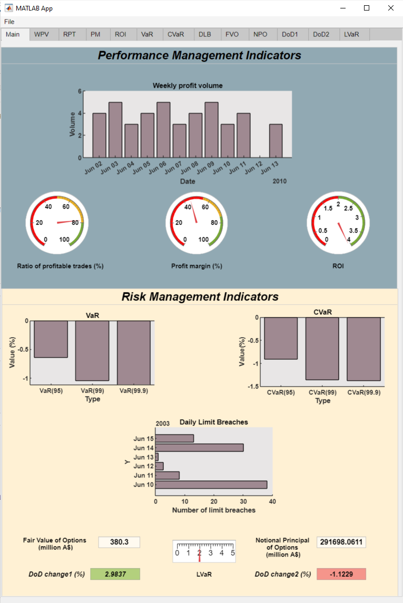

# MATLAB Challange Team Synergy
### Team members:
- Barabási Tamás
- Borsos András
- Breier Andrea
- Jakó Zsolt

## About the app
The purpose of this app is to create a custom dashboard for an options market making desk to report risk and performance analysis. The application imports real-time data from excel files thus creating an interactive visualisation of ten key risk metrics.

## How to use it

1. Open `app1.mlapp` and run the app.

## Required files:

File name | Metric name
--- | ---
`data1.xlsx` | Weekly profit volume
`data2.xlsx` | Ratio of profitable trades %
`data3.xlsx` | Profit margin
`data4.xlsx` | ROI
`data5.xlsx` | VaR
`data6.xlsx` | CVaR
`data7.xlsx` | Daily limit breaches
`data8.xlsx` | Fair value of options
`data9.xlsx` | Notional principal of options
`data10.xlsx` | LVaR

